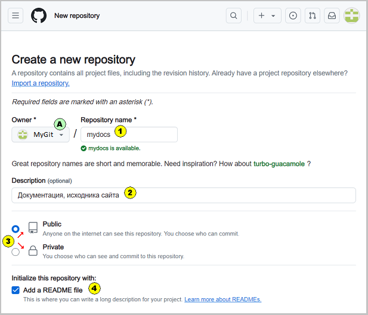
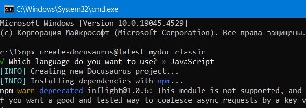
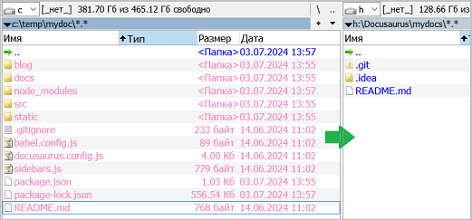

Сам процесс можно разделить на несколько этапов:
- Создание репозитория для хранения исходников сайта
- Создание локальной версии сайта
- Старт локальной версии сайта

## Создание репозитория для хранения исходников сайта
1.  На GitHub создаем репозиторий для хранения исходников сайта.   
      
    Рис. 1 - Настройка свойств в GitHub

    1\. Имя репозитория, например: mydocs, где A - имя аккаунта.      
    2\. Описание репозитория, например: Документация, исходника сайта   
    3\. Выбираем, какой будет репозиторий:   
        - Puplic - доступный всем для просмотра.   
        - Private - доступный тем, кто имеет разрешения.   

    4\. Обязательно ставим галку "Add a README file" для инициализации репозитория    

2.  В редакторе IntelliJ IDEA создаем новый проект, как меню "File - New - Project from Version Control"    
    
    Рис. 2 - Редактор IntelliJ, создание нового проекта

    1\. Вписываем интернет адрес репозитория  
    2\. Определяем каталог создания проекта  
    и затем нажимаем кнопку "Clone" внизу формы

## Создание локальной версии сайта
1.  Для этого на любом диске и каталоге (например, c:\temp) открываем консоль и выполняем команду создания сайта:  
    **npx create-docusaurus@latest mydoc classic**  
    Имя **"mydoc"** - это имя локального сайта и оно может быть любым
      
    Рис. 3 - Создание локальной версии сайта 

    В процессе создания базового сайта, надо будет выбрать либо JavaScript или TypeScript. 
    Сам процесс создания занимает некоторое время, результатом которого станет появление каталога mydoc.

2.  В созданный IntelliJ IDEA каталог проекта mydoc аккуратно копируем папки и файлы из каталога c:\temp\mydoc
      
    Рис. 4 - Перенос локальной версии в проект

    После копирования файлов, созданный в temp каталог mydoc можно удалить, но можно и не спешить это делать, 
    так как возможно он может потребоваться впоследствии, чтобы воспользоваться им, как шпаргалкой.  

3.  В IntelliJ IDEA скопированные файлы надо отметить для нового Commit в репозиторий:
      
    Рис. 5 - Выбор файлов (отметка), которые входят в проект

    Используя Ctrl+Стрелки отметить каталоги: blog, docs, src, static и все файлы в корне проекта, 
    а затем нажать комбинацию клавиш Ctrl+ Alt +A для включения их в лист будущих "коммитов". 

## Старт локального сайта
1.  Для проверки, что все действия были сделаны правильно, необходимо выполнить локальный запуск созданного сайта.
    Для этого необходимо запустить консоль в каталоге проекта mydoc и выполнить команду: **yarn start**
      
    Рис. 6 - Локальный старт сайта 

    При этом в консоли, если операция прошла успешно, будет сообщение "client compiled successfully!", иначе список ошибок.  
    Если старт выполнился успешно, то автоматически запустится browser и высветится страница, созданного сайта, 
    который является как демонстрацией возможностей, так и источником дополнительных знаний.

    :::tip Примечание
    Если надо прервать выполнение команды **yarn start** нажмите Ctrl+C
    :::

2.  Если старт выполнился успешно, то можно выполнить первый Commit и Push в созданный репозиторий на GitHub. 
    Для этого в горизонтальном меню редактора IntelliJ IDEA выбираем пункт Git и 
    далее пункты "Commit..." (создает лист изменений для передачи) и "Push..." (записывает изменения на Git). 
    В дальнейшем по мере исправления локального сайта, последующие "коммиты" будут содержать сделанные изменения. 
    И если, что-то "пошло ни-так", то всегда будет сохраняться возможность откатить сделанные изменения.
    
3. Выполнение "коммитов" перед командами развертывания сайта на GitHub меняет дату изменения страницы на дату последнего "коммита"  
      
    Рис. 7 - Пример измененной даты  

