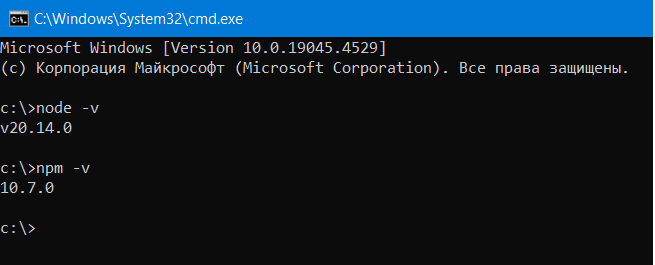
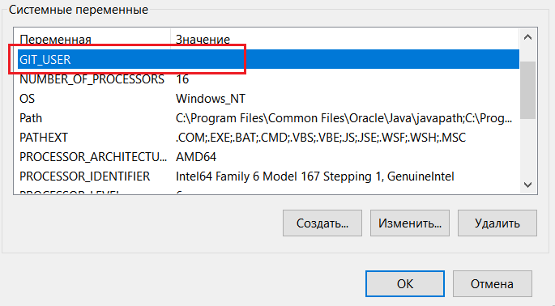

## Некоторые замечания:
Установка Docusaurus и создание проектов строиться исходя из некоторых предположений:
- сайт развертывается в интернете, используя технологию GitHub Pages, которая является частью платформы GitHub и 
  заточена специально под размещение сайтов в интернете
- имеется рабочий аккаунт на GitHub
- используется редактор кода IntelliJ IDEA, связанный для хранения исходного текста сайта на GitHub (необязательное условие)   

## Установка Docusaurus
Для развертывания Docusaurus на ПК под ОС Windows необходимо выполнить несколько шагов:
1.  Установить **node.js** - бесплатную кроссплатформенную среду выполнения JavaScript с открытым исходным кодом, 
    которая позволяет разработчикам создавать серверы, веб-приложения, инструменты командной строки и скрипты.  
    Для установки node.js ([перейдите по ссылке](https://nodejs.org/en)) и нажмите кнопку "Download Node.js":
      
    В папку Downloads на ПК будет скачан файл вида: node-vXX.XX.X-x64.msi, например: node-v20.14.0-x64.msi  
    После скачивания файла его необходимо инсталлировать.  
    
    Чтобы убедиться, что все установилось верно, выполнить в консоли две команды (node -v, npm -v):    
    
    
2.  Установить yarn - менеджер пакетов (см. https://classic.yarnpkg.com/en/docs/install#windows-stable), 
    для чего в консоли набрать команду: npm install --global yarn  
    Для проверки, что yarn установился верно, в консоли набрать команду: yarn --version  
      

3.  Создать новую переменную среды GIT_USER. Значение переменной - это имя вашего аккаунта на GitHub.    
    Значение переменной необходимо будет для выполнения команды yarn deploy - развертывание сайта на GitHub    
    

