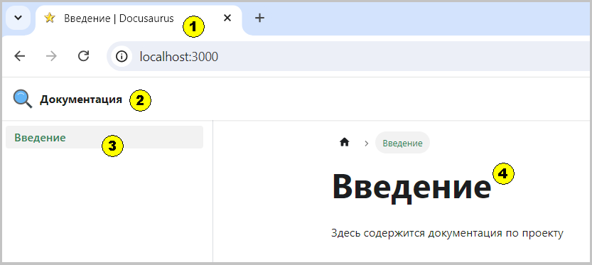

Для того чтобы выполнить первый старт "своего" сайта, необходимо выполнить ряд предварительных действий, 
связанных с изменением текущего контента сайта по умолчанию и изменению содержания его конфигурационных файлов: 

1. Часть предварительных настроек была уже выполнена изменением [конфигурационного](../create/deploy.md#настройка-конфигурационного-файла) файла.
2. Удаляем файл `src/pages/index.js` - это главная страница сайта по умолчанию.
3. Удаляем каталог blog
4. Очищаем каталог docs от содержимого
5. Добавляем в каталог docs файл about.md следующего содержания:

| содержание модуля                                       | примечание                                                                                  |
|---------------------------------------------------------|---------------------------------------------------------------------------------------------|
| ---                                                     | всегда начало заголовка страницы                                                        |
| title: 'Документация'                                   | служебное слово title: и в кавычках имя заголовка                                           |
| slug: /                                                 | служебное слово, в данном контексте из-за "/" указывает,  что это первая страница сайта |
| ---                                                     | всегда завершение описания заголовка страницы                                           |
| Здесь содержится документация, связанная с программами  | просто текст на странице без кавычек                                                        |

Для добавления каталогов или файлов в редакторе IntelliJ IDEA необходимо стать в нужном месте дерева проектов, 
нажать правую кнопку мыши и из выпадающего меню выбрать создаваемый элемент файл (1) или каталог (2). После появления окна (3) внести требуемое имя.    
  
Рис. 1 - Редактор IntelliJ IDEA, добавление файлов и каталогов

Заполнить созданный файл about.md в соответствии с таблицей:  
  
Рис. 2 - Заполнение файла about.md

6\. В модуле docusaurs.config.js выполняем действия:
- меняем (в самом верху) `const config = {` на `module.exports = {` 
- в конце модуля убираем выражение `export default config;`
- в `presents [ [ `меняем `classic,` на `'@docusaurus/preset-classic',`
- в `presents [ [ ({ docs:` добавляем `routeBasePath: '/',` - это откроет доступ к стартовой странице
- в `presents [ [ ({ docs:` добавляем `showLastUpdateTime: true,` - показывать последнею дату редактирования страницы 
- в `presents [ [` комментируем `**blog**` полностью (или удаляем) 
- в themeConfig комментируем массив items: [] полностью
- в themeConfig комментируем объект footers: {} полностью

**Можно** заместить содержимое docusaurus.config.js предлагаемым [текстом](pathname:///files/docusaurus.config_start.txt),
который уже содержит все нужные исправления.

7\. Модуль sidebars.js (отвечает за содержание закрепленной боковой панели) очищаем полностью от содержимого и записываем следующий текст:   
    `module.exports = { docs: ['about', ] }`, где:  
    - docs - это метка каталога docs
    - about - это имя странички, без расширения

8\. _Можно_ заместить стандартные иконки Docusaurus своими в папке static / img. Это файлы favicon.ico и logo.svg.  
Для этого можно воспользоваться поиском иконок и "пэнгэшек" в интернете, или скачать, используемые текущим сайтом:

- [favicon.ico](pathname:///files/favicon.ico)      
- [logo.svg](pathname:///files/logo.svg)

При скачивании картинки отобразятся в браузере, например Chrome. Вызвать меню по правой кнопке мыши, 
выполнить "Сохранить как..." и заместить в папке назначения с сохранением имени файла.
***
Сайт готов к первому запуску. 
В каталоге проекта в консоли выполняем команду: **yarn start**.
Если все было сделано правильно, то должна появиться стартовая страничка (about):  
  
Рис. 3 - Вид сайта со стартовой страничкой.

:::info Внимание
1. Для прерывания выполнения команд **yarn start** и **yarn serve** используется комбинация CTRL+C
2. Внесение изменений в код сайта, при выполнении команды **yarn start**, должно в on-line режиме менять содержание в браузере. 
Но это может происходить не всегда, например в силу ошибок. Поэтому может требоваться повторное выполнение команды **yarn start**.
3. Повторное выполнение команды **yarn start** не всегда гарантирует, что браузер отобразит последнею версию изменений, так как данные кэшируются браузером. 
Для перезапуска браузера используйте комбинацию CTRL+F5. Это замечание также касается развернутой в интернете версии.
:::

